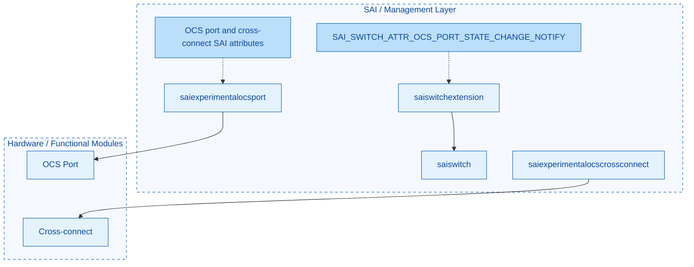
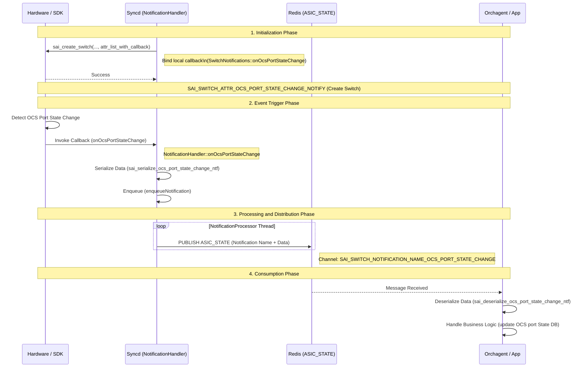
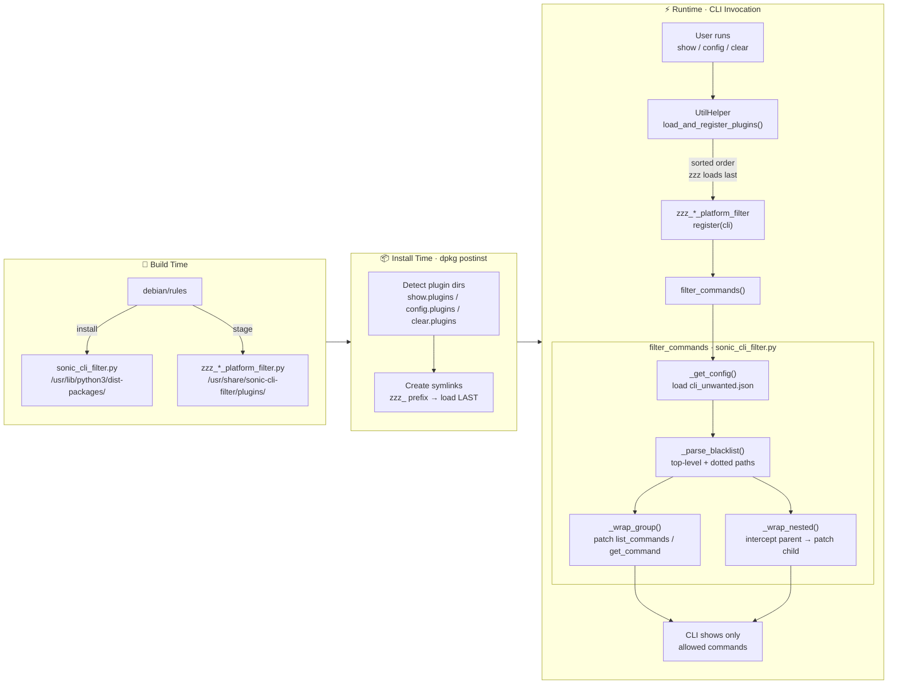

# SONiC-OCS Developer Guide

This document complies with the [SONiC HLD Template](https://github.com/sonic-net/SONiC/blob/master/doc/guidelines/hld_template.md). It will be evolved in parallel with the on-going prototyping, an OCS device as a KVM virtual machine.

- This document is complementary to the [OCS HLD](https://github.com/sonic-net/SONiC/pull/2269) and is mainly for sonic-ocs-wg development.
- The implementation of [OCS kvm](https://github.com/sonic-ocs/sonic-buildimage/tree/ocs-dev) is here.
- Build and run instructions for OCS kvm are in the [README.md](https://github.com/sonic-ocs/sonic-buildimage/blob/ocs-dev/platform/ocs-kvm/README.md).


## Table of Contents

- [SONiC-OCS Developer Guide](#sonic-ocs-developer-guide)
  - [Table of Contents](#table-of-contents)
  - [1 Revision](#1-revision)
  - [2 Scope](#2-scope)
  - [3 Definitions/Abbreviations](#3-definitionsabbreviations)
    - [Table 1: Abbreviations](#table-1-abbreviations)
  - [4 Overview](#4-overview)
  - [5 Requirements](#5-requirements)
    - [5.1 Functional requirements](#51-functional-requirements)
    - [5.2 Scaling requirements](#52-scaling-requirements)
    - [5.3 Alarm](#53-alarm)
    - [5.4 PM Counter](#54-pm-counter)
    - [5.5 Telemetry](#55-telemetry)
  - [6 Architecture Design](#6-architecture-design)
    - [6.1 Design Principles](#61-design-principles)
    - [6.2 SONiC Extension Points for OCS Support](#62-sonic-extension-points-for-ocs-support)
  - [7 High-Level/Module Design](#7-high-levelmodule-design)
    - [7.1 OCS Device Metadata](#71-ocs-device-metadata)
    - [7.2 SWSS Extension for OCS Optical Traffic](#72-swss-extension-for-ocs-optical-traffic)
      - [7.2.1 SWSS Config Manager (TBD)](#721-swss-config-manager-tbd)
      - [7.2.2 SWSS orchagent](#722-swss-orchagent)
    - [7.3 OCS State DB Update and Port status notification](#73-ocs-state-db-update-and-port-status-notification)
    - [7.4 SyncD Extension](#74-syncd-extension)
    - [7.5 PMON](#75-pmon)
      - [7.5.1 PMON Base Class](#751-pmon-base-class)
      - [7.5.2 Device specific platform config and driver](#752-device-specific-platform-config-and-driver)
      - [7.5.3 Linecard Hot-pluggable](#753-linecard-hot-pluggable)
      - [7.5.4 Firmware Upgrade](#754-firmware-upgrade)
    - [7.6 SONiC host containers](#76-sonic-host-containers)
  - [8 SAI API](#8-sai-api)
  - [9 Configuration and management](#9-configuration-and-management)
    - [9.1 Manifest (if the feature is an Application Extension)](#91-manifest-if-the-feature-is-an-application-extension)
    - [9.2 CLI/YANG model Enhancements](#92-cliyang-model-enhancements)
      - [9.2.1 OCS SONiC Yang Model](#921-ocs-sonic-yang-model)
      - [9.2.2 CLI](#922-cli)
        - [CLI Filtering Mechanism](#cli-filtering-mechanism)
      - [9.2.3 RESTCONF API](#923-restconf-api)
    - [9.3 Reuse Existing Features](#93-reuse-existing-features)
      - [9.3.1 Management and Loopback Interface](#931-management-and-loopback-interface)
      - [9.3.2 TACACS+ AAA](#932-tacacs-aaa)
      - [9.3.3 Syslog](#933-syslog)
      - [9.3.4 NTP](#934-ntp)
      - [9.3.5 Telemetry and gNMI](#935-telemetry-and-gnmi)
      - [9.3.6 SONiC Management Framework](#936-sonic-management-framework)
      - [9.3.7 SONiC upgrade](#937-sonic-upgrade)
  - [10 Warmboot and Fastboot Design Impact](#10-warmboot-and-fastboot-design-impact)
    - [Warmboot And Fastboot Performance Impact](#warmboot-and-fastboot-performance-impact)
  - [11 Memory Consumption](#11-memory-consumption)
  - [12 Restrictions/Limitations](#12-restrictionslimitations)
  - [13 Testing Requirements/Design (**TBD**)](#13-testing-requirementsdesign-tbd)
    - [13.1 Unit Test cases](#131-unit-test-cases)
    - [13.2 System Test cases](#132-system-test-cases)
  - [14 Open/Action items](#14-openaction-items)


## 1 Revision


| Rev | Date       | Author            | Change Description                                                                                                                                                   |
| --- | ---------- | ----------------- | -------------------------------------------------------------------------------------------------------------------------------------------------------------------- |
| 0.2 | 08/19/2026 | Jimmy Jin         | `powered_off` in YANG; State DB-only physical path / factory IL; SAI notify in 7.3; SAI API points to [PR 2229](https://github.com/opencomputeproject/SAI/pull/2229) |
| 0.1 | 08/12/2026 | Jimmy Jin, Lu Mao | Initial version, Some portion is derived from [sonic-otn-wp](https://github.com/sonic-otn/SONiC-OTN)                                                                 |


## 2 Scope

This document describes the architecture and high level design for extending SONiC to support Optical Circuit Switch (OCS) device.

## 3 Definitions/Abbreviations


### Table 1: Abbreviations


|     |                              |
| --- | ---------------------------- |
| OCS | Optical circuit switch       |
| NOS | Network operating system     |
| SA  | Service-affecting            |
| NSA | Non-service-affecting        |
| PM  | Performance management       |
| SAI | Switch Abstraction Interface |
| DCI | Inter data center connection |


## 4 Overview

Optical circuit switch (OCS), also known as an all-optical switch, is a technology that establishes optical connections between fibers, allowing data transmission without the need for electrical switching and conversion (OEO). Here are some advantages of OCS comparing to the electrical switches:

- Improved Performance:
OCS can offer lower latency and higher throughput. This is because OCS operates at the physical layer, directly switching light signals rather than processing electrical packets.
- Scalability:
OCS can be used to create large-scale, reconfigurable networks without the limitations of traditional electrical switches.
- Reduced Energy Consumption:
OCS consumes less power than EPS, leading to significant energy savings in large data centers.
- Reconfigurable Topologies:
OCS enables the creation of dynamic, logical topologies that can be adapted to changing communication patterns.
- Failure Resilience:
OCS can provide alternative paths for data transmission, improving network resilience.

As such, OCS can be used in various network use cases. One of the main applications of OCS is to connect a large number of AI computing nodes to form an AI super computing cluster, as shown in the following diagram [(source):](https://arxiv.org/pdf/2304.01433)

OCS for AI

Another OCS use case is to provide low power consumption and low latency inter data center connections (DCI), shown in the following diagram: [(source)](https://www.microsoft.com/en-us/research/publication/beyond-the-mega-data-center-networking-multi-data-center-regions/)

OCS for DCI

This document provides high level design of extending SONiC to support OCS device, including yang model, SAI APIs, orchestration agent, syncd, Config and APP DB Schemas and other SONiC changes required to bring up SONiC image on an OCS device.

## 5 Requirements


### 5.1 Functional requirements

At a high level the following should be supported:

- Bring up SONiC image for DEVICE_METADATA type - `SonicOCS`
- Bring up swss/syncd containers for switch_type - `ocs`
- Able to manage OCS device configured via REST, gNMI client and CLI
- Device Management functions including:
  - Configuration - system, OCS port and OCS cross-connect.
  - State report - system, OCS port and OCS cross-connect.
  - Operations: restart (warm, cold and power-on), SW/FW upgrade
  - Telemetry: Data streaming for time sensitive state.
  - Alarm notification for system faults.
  - PM statistics counters for important performance parameters.

The OCS deployment and device management in a data center for AI application is illustrated in the following diagram:

OCS Deployment

### 5.2 Scaling requirements

Following are the scaling requirements: [*TBD*]


| Item          | Expected Max value |
| ------------- | ------------------ |
| Ports         | 2x1024             |
| Cross-connect | 1024               |


### 5.3 Alarm

Alarms that listed in the following table should be supported:**[TBD]**


| Alarm name  | Severity |
| ----------- | -------- |
| Port-failed | SA       |
| PUS Failed  | NSA      |


### 5.4 PM Counter

Network equipment performance management counters are metrics that monitor and provide insights into the performance of network devices. They help identify potential issues, bottlenecks, and areas for optimization, enabling network administrators to proactively manage and troubleshoot their infrastructure:

For each PM parameters, the following statistics should be available for users:

- 96 (32) buckets of 15-minute counters including min, max and average.
- 7 buckets of 24-hour counters with min, max and average.

PM parameters that listed in the following table should be supported:**[TBD]**


| PM name           | Data Type |
| ----------------- | --------- |
| Temperature       | decimal2  |
| PUS Input Current | decimal2  |
| Fan Speed         | int32     |


### 5.5 Telemetry

OCS should support telemetry features. Both [dial-in](https://github.com/sonic-net/sonic-telemetry/blob/master/doc/grpc_telemetry.md) and [dial-out](https://github.com/sonic-net/sonic-telemetry/blob/master/doc/dialout.md) modes for telemetry should be supported.

## 6 Architecture Design

This section describes the overall changes needed for supporting OCS devices.

### 6.1 Design Principles

While SONiC is a packet switch NOS, its modular design and built-in extensibility infrastructure allow developers to add functionality beyond the packet switching domain.

The following guidelines should be followed while developing a SONiC-based NOS for OCS.

- Fully utilize SONiC's rich extension mechanism to make the change as seamless as possible so that OCS support becomes an organic part of SONiC.
- Complete reuse SONiC generic system features as is, including NBI (REST, CLI, gNMI), telemetry, user management, syslog notification, SW/FW upgrade, chassis/PSU/LED/FAN/temperature management, etc.
- Changes for OCS support should be modular and relatively isolated from the packet switching logic with non/minimum impact on existing packet switching functions.
- For major feature gaps, such as PM, alarm and hot pluggable, enhancement design and implement should be in a generic way, not just for OCS.
- All changes should be compatible to the upstream SONiC code base and ready to be merged. The final goal is that all OCS vendors should be able to pull the official SONiC code and build SONiC OCS images for their devices.


### 6.2 SONiC Extension Points for OCS Support

The following diagram shows the main changes and extension points of SONiC to support OCS device:

OCS Extension

1. Add OCS SONiC yang (`sonic-ocs.yang`) and support REST API and CLI.
2. Redis DB: Add new CONFIG, STATE and APP tables (ocs-port, cross-connect).
3. Config Manager: Add Config manager for port and connections.
4. Chassis Drivers: Add user and kernel drivers for Fan, PSU, LED and temperature sensors, FPGA.
5. SAI: Extend SAI to support OCS using SAI experimental extension mechanism.
6. SyncD: SyncD driver supporting extended OCS SAI attributes.
7. Platform and device: Add OCS as a new sonic platform ocs and new OCS device, supporting configurable port counts (16x16, 64x64 and 512x512 etc.).
8. ONIE: Create ONIE image for installing SONiC image on OCS devices, support secure boot.


## 7 High-Level/Module Design

This section describes changes at SONiC module level to support OCS devices.

### 7.1 OCS Device Metadata

In DEVICE meta data table, a new type, `SonicOCS`, and new switch_type, `ocs`, are added:

```JSON
"DEVICE_METADATA": {
    "localhost": {
        "type": "SonicOCS",
        "switch_type": "ocs",
     }
}
```

see [code here](https://github.com/sonic-ocs/sonic-buildimage/blob/ocs-dev/device/virtual/x86_64-ocs-kvm_x86_64-r0/ocs-metadata.json).

### 7.2 SWSS Extension for OCS Optical Traffic

Two SONiC built-in containers, swss and syncd, are at the core for providing data path control and monitoring, as shown in the following diagram:

swss and syncd

#### 7.2.1 SWSS Config Manager (TBD)

In the SWSS container, a new config manager daemon, [ocsmgrd](https://github.com/sonic-ocs/sonic-swss/blob/ocs-dev/cfgmgr/ocsmgrd.cpp), is created to subscribe to changes in OCS tables in Config DB. When a config change is notified, the OCS config manager updates the corresponding tables in APP DB.

An alternative proposal is to let Orchagent subscribe to Config DB OCS tables directly, without a separate `ocsmgrd`. Which approach to take is **TBD**.

#### 7.2.2 SWSS orchagent

Orchagent is extended with a [separate folder](https://github.com/sonic-ocs/sonic-swss/tree/ocs-dev/orchagent/ocs) to support OCS devices.

Currently, SONiC supports two types of Orch Daemon based on `switchType`, `orchDaemon` or `fabricOrchDaemon`. A new type of orchDaemon, `OcsOrchDaemon`, is added to support OCS devices. At run time, `switchType == ocs` is used to determine if [ocsOrchDaemon](https://github.com/sonic-ocs/sonic-swss/blob/ocs-dev/orchagent/ocs/ocsorchdaemon.cpp) should be created. Please see the [code here](https://github.com/sonic-ocs/sonic-swss/blob/ocs-dev/orchagent/main.cpp).

```c++
    if(switchType == "ocs")
    {
        orchDaemon = make_shared<OcsOrchDaemon>;
    }
    else if (switchType != "fabric")
    {
        orchDaemon = make_shared<OrchDaemon>();
    }
    else
    {
        orchDaemon = make_shared<FabricOrchDaemon>();
    }
```

Creating a new type of OrchDaemon isolates OCS support from the existing logic, resulting in no impact on existing packet features.

### 7.3 OCS State DB Update and Port status notification

This section describes how to support OCS state update in STATE DB. Attributes specified in `sonic-ocs-states.yang` need to be updated so that NBI (CLI/RESTCONF/gNMI) can read OCS status from State DB.

Most read-only leaves in `sonic-ocs-states.yang` are static manufacturing or inventory data (connector type, physical path, factory insertion loss). These can be populated by OCS orchagent at start-up. Port operational status is updated asynchronously via the SAI notification mechanism.

SONiC has a notification mechanism supporting notifications from Vendor SAI (driver) to SWSS. Currently the notification is only supported by the root SAI object (switch), in which all notification callback attributes and prototypes are defined in `saiswitch.h`. When the switch object is created during SWSS startup, all notification attributes are set with the corresponding callbacks in Orchagent (`main.cpp`). Notification callbacks are defined in `Notification.h|cpp` in Orchagent. When Syncd receives switch creation from Orchagent, it registers its own callbacks to the SAI vendor drivers. When an event is detected by Vendor SAI, the registered Syncd callback will be called with the driver data passed as function parameters. The Syncd callback sends a message via Redis to SWSS Orchagent, which calls the SWSS callback to handle the event.

***OCS Notification Extension***

In order to separate OCS notification code from the existing switch code, a notification attribute for OCS port state change is declared in SAI extension [saiswitchextensions.h](https://github.com/opencomputeproject/SAI/blob/master/experimental/saiswitchextensions.h).

```c
/**
 * @brief OCS port state change event notification
 *
 * @count data[count]
 *
 * @param[in] count Number of notifications
 * @param[in] data Array of OCS port state change events
 */
typedef void (*sai_ocs_port_state_change_notification_fn)(
        _In_ uint32_t count,
        _In_ const sai_ocs_port_oper_status_notification_t *data);

/**
 * @brief SAI switch attribute extensions.
 *
 * @flags free
 */
typedef enum _sai_switch_attr_extensions_t
{
     ....
     /**
     * @brief Set Switch OCS port state change event notification callback function passed to the adapter.
     *
     * Use sai_ocs_port_state_change_notification_fn as notification function.
     *
     * @type sai_pointer_t sai_ocs_port_state_change_notification_fn
     * @flags CREATE_AND_SET
     * @default NULL
     */
    SAI_SWITCH_ATTR_OCS_PORT_STATE_CHANGE_NOTIFY,

    SAI_SWITCH_ATTR_EXTENSIONS_RANGE_END

} sai_switch_attr_extensions_t;
```

The `sai_ocs_port_oper_status_notification_t` payload type is proposed alongside `sai_ocs_port_state_change_notification_fn` (the function type named by [saiswitchextensions.h](https://github.com/opencomputeproject/SAI/blob/master/experimental/saiswitchextensions.h)). Confirm the struct definition against the SAI experimental headers when implementing Syncd/SWSS serialize.

***OCS Port Object***

OCS port operational status (`SAI_OCS_PORT_ATTR_OPER_STATUS`) is reported asynchronously via `SAI_SWITCH_ATTR_OCS_PORT_STATE_CHANGE_NOTIFY` on the switch object, as shown in the following diagram:




The functionality of the OCS notification path includes:

- Report OCS port operational state changes (for example powered-off, blocked, tuning, connected, failed) without polling.
- Register OCS event notification callbacks on the `saiswitch` object via `SAI_SWITCH_ATTR_OCS_PORT_STATE_CHANGE_NOTIFY`. This avoids the need for the OCS project to change existing packet-switch notification attributes in Orchagent `main.cpp` and isolates the new OCS code from the existing switch codebase.

***OCS Event Notification Registration***

OCS port state change notification reuses the existing SONiC notification mechanism without changing the existing SWSS and Syncd code. The steps are shown in the following diagram:

- During Orchagent startup, when the switch object is created, it sets the OCS notification callback `SAI_SWITCH_ATTR_OCS_PORT_STATE_CHANGE_NOTIFY` on the `saiswitch` object.
- When Syncd receives switch creation from Orchagent, it registers its own callbacks to the SAI vendor drivers.
- When an OCS port state change is detected by Vendor SAI, the registered Syncd callback will be called with the driver data passed as function parameters.
- The Syncd callback sends a message via Redis to SWSS Orchagent, which calls the SWSS callback to handle the event and update State DB.




### 7.4 SyncD Extension

In progress.

### 7.5 PMON

SONiC pmon (platform monitor) manages generic hardware, which is independent from the functionality of the device providing. pmon infrastructure is implemented in two repositories, [sonic-platform-common](https://github.com/sonic-net/sonic-platform-common) and [sonic-platform-daemon](https://github.com/sonic-net/sonic-platform-daemons) described in [this doc](https://github.com/sonic-net/SONiC/blob/master/doc/platform_api/new_platform_api.md). And Vendor platform module resides under `sonic-buildimage/platform` folder for each device type.

#### 7.5.1 PMON Base Class

Python classes are implemented to model the generic hardware structure and operations on the hardware. Here is the example of a typical device structure in python classes:

- Chassis
  - System EEPROM info
  - Reboot cause
  - Environment sensors
  - Front panel/status LEDs
  - Power supply unit[0 .. p-1]
  - Fan[0 .. f-1]
  - Module[0 .. m-1] (Line card, supervisor card, etc.)
    - Environment sensors
    - Front-panel/status LEDs
    - SFP cage[0 .. s-1]
    - Components[0 .. n-1] (CPLD, FPGA, MCU, ASIC etc.)
      - name
      - description
      - firmware


#### 7.5.2 Device specific platform config and driver

The [JSON file](https://github.com/sonic-ocs/sonic-buildimage/blob/ocs-dev/device/virtual/x86_64-ocs-kvm_x86_64-r0/platform.json) is to define the OCS device HW hierarchy for an OCS virtual device. 

 PMON driver for ocs-kvm is [implemented here](https://github.com/sonic-ocs/sonic-buildimage/tree/ocs-dev/platform/ocs-kvm/sonic-platform-modules-ocs-kvm/ocs-v/sonic_platform).

 Note that both PMON config file and driver are device specific for a particular OCS device.

#### 7.5.3 Linecard Hot-pluggable

Currently, SONiC supports two chassis types:

- Pizza box without pluggable supervisor/control card and line cards
- Multi-Asic, in which each line cards running an independent SONiC

An OCS device may not fit either of the above architecture. A typical OCS device contains multiple driver cards which control the OCS port array angles. When a driver card is removed or inserted, orchagent should be notified so that all affected ports and connections are removed from or added to the syncd monitoring thread. The port and connection status should also be updated in State DB.

Line Card syncd

As shown in the above diagram, a new line card monitoring daemon is added to the PMON container for line card operation status monitoring.

Line card un-plug/failed:

- PMON detects a line card is removed. It changes the status of a line card from online to `empty/fault`. The linecardsyncd should update all the ports that are affected by this line card by changing the port admin state (port-config-override-state) in APP DB to `powered-off`.
- Orchagent (`ocsportorch`) will be triggered to remove corresponding SAI port objects and associated flexcounter entries.
- Syncd will stop monitoring the removed resource (port and connections). Ports and connections in State DB should be updated as well.

Line card insert:

- PMON detects a line card is back online (LC communication is OK). It changes the status of a line card to online. The line card daemon should update APP DB for all the ports that are affected by this line card by restoring the port admin state from Config DB.
- If the port admin state is `normal`, Orchagent (`ocsportorch`) will be triggered to create corresponding SAI port objects and associated flexcounter entries.
- Syncd will start monitoring the resource (port and connections). Ports and connections in State DB should be updated as well.


#### 7.5.4 Firmware Upgrade

SONiC provides a generic mechanism to install/upgrade firmware, [fwutil.md](https://github.com/sonic-net/SONiC/blob/master/doc/fwutil/fwutil.md).

OCS vendors need to implement the Python component APIs defined in the base class [component_base.py](https://github.com/sonic-net/sonic-platform-common/blob/master/sonic_platform_base/component_base.py), including get firmware version, install firmware, and update firmware.

### 7.6 SONiC host containers

The following containers shall be enabled for SONiC and part of the image. Switch specific containers shall be disabled for the image built for the OCS devices. Need to change the SONiC build [rule/config](https://github.com/sonic-net/sonic-buildimage/blob/master/rules/config) accordingly.


| Container/Feature Name | Is Enabled? |
| ---------------------- | ----------- |
| SNMP                   | Yes         |
| Telemetry              | Yes         |
| LLDP                   | No          |
| Syncd                  | Yes         |
| Swss                   | Yes         |
| Database               | Yes         |
| BGP                    | Yes         |
| Teamd                  | No          |
| Pmon                   | Yes         |
| Nat                    | No          |
| Sflow                  | No          |
| DHCP Relay             | No          |
| Radv                   | No          |
| Macsec                 | No          |
| Restapi                | Yes         |
| gNMI                   | Yes         |


BGP is enabled for the DCN / management network (see [Section 9.3.1](#931-management-and-loopback-interface)), not for packet-switch data-plane features. Packet-oriented BGP CLI is hidden by the CLI filter in [Section 9.2.2](#922-cli).

## 8 SAI API

OCS SAI objects, attributes, and APIs are added through the SAI experimental extension mechanism. The OCS SAI design and headers are in [opencomputeproject/SAI PR 2229](https://github.com/opencomputeproject/SAI/pull/2229). See also the [SAI experimental extension design](https://github.com/opencomputeproject/SAI/blob/master/doc/SAI-Extensions.md). OCS port operational state change uses `SAI_SWITCH_ATTR_OCS_PORT_STATE_CHANGE_NOTIFY`; see [Section 7.3](#73-ocs-state-db-update-and-port-status-notification).

## 9 Configuration and management

This section has sub-sections for all types of configuration and management related design. Sub-sections related to data models (YANG, REST, gNMI, etc.) are included as well.

### 9.1 Manifest (if the feature is an Application Extension)

N/A

### 9.2 CLI/YANG model Enhancements

This sub-section covers the addition/deletion/modification of CLI changes and YANG model changes needed for the feature in detail.

#### 9.2.1 OCS SONiC Yang Model

The following are the schema changes. The NorthBound APIs shall be defined as sonic-yang in compliance to [yang-guideline](https://github.com/Azure/SONiC/blob/master/doc/mgmt/SONiC_YANG_Model_Guidelines.md):

- [sonic-ocs.yang](https://github.com/sonic-ocs/sonic-buildimage/blob/ocs-dev/src/sonic-yang-models/yang-models/sonic-ocs.yang) — Config DB. Port `state` shall include `normal`, `force_blocked`, and `powered_off`.
- [sonic-ocs-states.yang](https://github.com/sonic-ocs/sonic-buildimage/blob/ocs-dev/src/sonic-yang-models/yang-models/sonic-ocs-states.yang) — State DB, including physical path and factory insertion loss.


#### 9.2.2 CLI

Most sonic CLI is implemented in sonic-utilities based on the [python click library](https://click.palletsprojects.com/en/8.1.x/). These CLIs are supported in [sonic-utilities](https://github.com/sonic-net/sonic-utilities). It is preferred that OCS CLI adopt auto-generation, instead of hard-coded Python, for better maintenance and consistency.

Automatically generates click based Python CLI code from SONiC yang, using [SONiC CLI auto-generation tool](https://github.com/sonic-net/SONiC/blob/master/doc/cli_auto_generation/cli_auto_generation.md).

```bash
admin@sonic: sonic-cli-gen generate config sonic-ocs
admin@sonic: sonic-cli-gen generate show sonic-ocs-states
```

The following OCS commands will be added after CLI is generated:

```bash
 - show ocs-port //config
 - show ocs-cross-connect //config
 - show ocs-port-table //state
 - show ocs-cross-connect-table //state
 - config ocs-port 1B --config-status [force-blocked | normal | powered-off]
 - config ocs-cross-connect [add | delete | update] conn-id [sideA | sideB]
```


##### CLI Filtering Mechanism

SONiC is designed for data-center switches, so its CLI includes many commands that are irrelevant on OCS optical platforms. Exposing these commands to operators causes confusion and may lead to misconfigurations.
For an OCS device, as it does not support most CLIs for packet switch, a masking/filtering mechanism is designed, so that each device type can only include the CLIs that it supports.

Platform-specific CLI command filter for SONiC OCS platforms. Removes unwanted switch-oriented CLI commands (VLAN, VXLAN, NAT, BGP, etc.) from the SONiC `show` / `config` / `clear` CLIs based on a ***per-device*** JSON blacklist.

The plugin mechanism in **sonic-utilities** is a Python-based framework that makes the SONiC CLI extensible for third-party features and vendor-specific hardware. The OCS CLI filter uses this mechanism to inject plugins that run after other plugins register commands; the filter then patches Click `Group` objects to hide blacklisted commands at runtime.
The filter wraps `click.Group.list_commands` and `click.Group.get_command` rather than deleting command objects. This means commands registered **after** the filter plugin loads are also hidden, as long as they match a blacklist entry.

The OCS implementation lives under `platform/ocs-kvm/sonic-cli-filter` ([ocs-kvm](https://github.com/sonic-ocs/sonic-buildimage/tree/ocs-dev/platform/ocs-kvm/sonic-cli-filter)):

```
sonic-cli-filter/
├── sonic_cli_filter.py            # Core filtering logic
├── plugins/
│   ├── zzz_show_platform_filter.py    # Plugin for "show" CLI
│   ├── zzz_config_platform_filter.py  # Plugin for "config" CLI
│   └── zzz_clear_platform_filter.py   # Plugin for "clear" CLI
├── debian/
│   ├── changelog
│   ├── compat
│   ├── control
│   ├── install
│   ├── postinst                       # Symlinks plugins into sonic-utilities
│   ├── prerm                          # Removes symlinks on uninstall
│   └── rules
└── README.md
```

Device-level configuration file (separate from this package) in sonic-buildimage device directory:

```bash
device/<vendor>/<platform>/cli_unwanted.json
```


###### Workflow

The end-to-end workflow involves **build-time packaging**, **install-time wiring**, and **runtime filtering**.




###### Configuration Example — `cli_unwanted.json`

Located at `/usr/share/sonic/device/<platform>/cli_unwanted.json`. Example:

```json
{
    "show": [
        "vlan",
        "vxlan",
        "nat",
        "ip.bgp",
        "ipv6.bgp"
    ],
    "config": [
        "vlan",
        "vxlan",
        "nat"
    ],
    "clear": [
        "nat",
        "watermark"
    ]
}
```

- Top-level entries (`"vlan"`) hide the command directly under the root group.
- Dotted entries (`"ip.bgp"`) hide a sub-command under a parent group — `ip bgp` is hidden while other `ip` sub-commands remain available.

#### 9.2.3 RESTCONF API

SONiC management framework infrastructure's Translib converts the data models exposed to the management clients into the Redis ABNF schema format. See HLD [here](https://github.com/sonic-net/SONiC/blob/master/doc/mgmt/Management%20Framework.md).

Therefore, after `sonic-ocs.yang` is added into the `sonic-mgmt-common` yang model [directory](https://github.com/sonic-ocs/sonic-mgmt-common/blob/ocs-dev/models/yang/sonic), RESTCONF is supported automatically.

### 9.3 Reuse Existing Features

SONiC is a mature NOS, which provides most system management features. These features can be used for OCS devices as-is without any changes.

#### 9.3.1 Management and Loopback Interface

OCS device will supports at least one DCN interface for device management (NBI).

There are few alternate ways by which a static IP address can be configured for the management interface.

- Use Click CLI:

```
admin@OCS001:~$ config interface ip add eth0 <ip_addr> <default gateway IP>
```

- Use config_db.json and configure the MGMT_INTERFACE key with the appropriate values. See the config of management interface [here](https://github.com/sonic-net/SONiC/wiki/Configuration#management-interface).
- The same method can be used to configure the Loopback interface address.
  - /sbin/ifconfig lo Linux command shall be used. OR,
  - Add the key LOOPBACK_INTERFACE and value in config_db.json and load it.

Additionally, the management interfaces should support L3 routing protocol, OSPF and BGP.

#### 9.3.2 TACACS+ AAA

 Please see [here](https://github.com/sonic-net/SONiC/blob/master/doc/aaa/TACACS%2B%20Authentication.md).

#### 9.3.3 Syslog

Please see [here](https://github.com/sonic-net/SONiC/blob/master/doc/syslog/syslog-design.md).

#### 9.3.4 NTP

Please see [here](https://github.com/sonic-net/SONiC/blob/master/doc/ntp/ntp-design.md).

#### 9.3.5 Telemetry and gNMI

The older `[sonic-telemetry](https://github.com/sonic-net/sonic-telemetry)` module is superseded for this design. gNMI set/get/telemetry is supported by [gNMI Server](https://github.com/sonic-net/sonic-gnmi). Design doc is [here](https://github.com/sonic-net/SONiC/blob/master/doc/mgmt/gnmi/SONiC_GNMI_Server_Interface_Design.md).

#### 9.3.6 SONiC Management Framework

[SONiC Management Framework](https://github.com/sonic-net/SONiC/blob/master/doc/mgmt/Management%20Framework.md) is designed and implemented to support NBI interfaces:

1. Developers can write CLI (xml, actioner and renderer) based on the [klish framework](https://src.libcode.org/pkun/klish/src/master). Please see [CLI section](https://github.com/sonic-net/SONiC/blob/master/doc/mgmt/Management%20Framework.md#3121-cli).
2. Its `Translib` converts the data models exposed to the management clients into the Redis ABNF schema format. Please see [this section](https://github.com/sonic-net/SONiC/blob/master/doc/mgmt/Management%20Framework.md#3224-REST-server). For example, after `sonic-ocs.yang` is added into the sonic-mgmt-common yang model [directory](https://github.com/sonic-ocs/sonic-mgmt-common/blob/ocs-dev/models/yang/sonic), RESTCONF is supported automatically.
3. It also supports gNMI set/get/telemetry. Please see [this section](https://github.com/sonic-net/SONiC/blob/master/doc/mgmt/Management%20Framework.md#3123-gnmi).

OCS uses the management framework for RESTCONF/gNMI (YANG) and Click CLI auto-generation for host CLI. Whether additional klish CLIs are needed is **TBD**.

#### 9.3.7 SONiC upgrade

Please see [here](https://github.com/sonic-net/SONiC/wiki/SONiC-to-SONiC-update).

## 10 Warmboot and Fastboot Design Impact

OCS support does not depend on or affect current SONiC warmboot and fastboot behavior. Warm reboot should remain a non-service-affecting (NSA) operation.

The extended OCS logic is active only for OCS platforms (such as `ocs-kvm`); it does not run — at either build time or run time — for existing packet-switch platforms. Extra OCS features are implemented under `platform/ocs-XXX` and associated OCS devices.

### Warmboot And Fastboot Performance Impact

OCS enhancements are designed to keep control-plane and data-plane downtime unchanged from stock SONiC. The points below apply only to OCS platforms; on existing packet-switch platforms none of this OCS code is built or run:

- **Boot critical chain:** OCS does not add stalls/sleeps/blocking IO to the warmboot/fastboot critical path. OCS-specific processing (Orchagent object CRUD, port-state notifications) runs after startup and does not gate the boot sequence.
- **CPU-heavy processing:** CLI auto-generation (`sonic-cli-gen`) and CLI filter plugin load occur at container/host start, not in the reboot critical path. No additional heavy Jinja rendering is introduced on the boot path for packet-switch builds.
- **Third-party dependencies:** The vendor SAI OCS driver Debian package is pulled at build time only for OCS platforms.
- **Delayability:** PM statistics and optical-control style application daemons, if added later, can start after core bring-up.
- **Optimizations:** On OCS platforms, packet features are disabled, so fewer Orchagent objects and containers are initialized.


## 11 Memory Consumption

On an OCS device, most packet features are not enabled in SWSS (configMgr and Orchagent). Memory consumption is therefore expected to be lower than on a packet switch. Quantitative numbers are **TBD**.

## 12 Restrictions/Limitations

- OCS images disable packet-switch-only containers (Teamd, NAT, sFlow, MACsec, DHCP Relay, Radv).
- Scaling, alarm list, and PM parameter list are still TBD (see Section 5).
- Line-card hot-plug and `ocsmgrd` vs Orchagent Config DB subscription are not fully implemented.


## 13 Testing Requirements/Design (**TBD**)

Unit, system, regression, and warmboot/fastboot testing are required. Existing warmboot/fastboot data-plane disruption limits must still be met after OCS support is added.

### 13.1 Unit Test cases

- YANG/CVL validation for `OCS_PORT` and `OCS_CROSS_CONNECT` Config DB entries.
- Orchagent CRUD for OCS port and cross-connect SAI objects (`switch_type=ocs` only).
- CLI auto-generation and `cli_unwanted.json` filtering.
- SAI OCS port state change notification serialize/deserialize.


### 13.2 System Test cases

- Bring-up of the OCS KVM image with `DEVICE_METADATA.type=SonicOCS`.
- RESTCONF/gNMI/CLI config and state for ports and cross-connects.
- Port state change notification updates State DB.
- Warm reboot remains NSA; cold reboot restores Config DB cross-connects.


## 14 Open/Action items

- Decide `ocsmgrd` vs Orchagent-direct Config DB subscription (Section 7.2.1).
- Complete Syncd OCS object handling (Section 7.4).
- Confirm `sai_ocs_port_oper_status_notification_t` in upstream SAI experimental headers (Section 7.3).
- Fill scaling, alarm, and PM tables (Section 5).
- Threshold management for optical signal quality.

